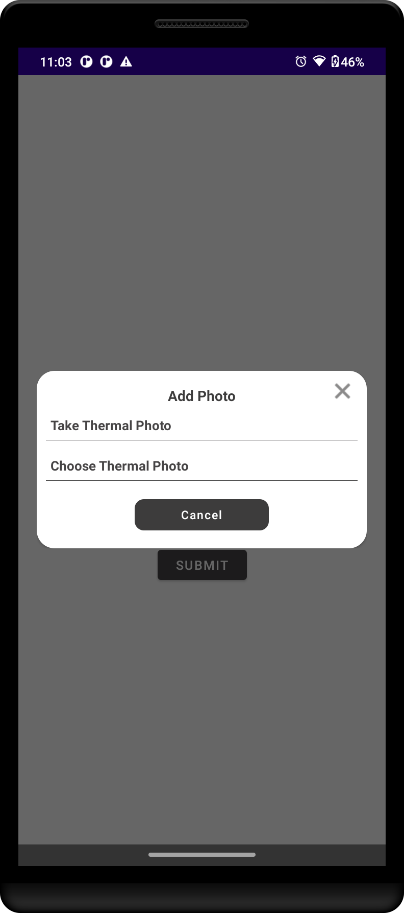
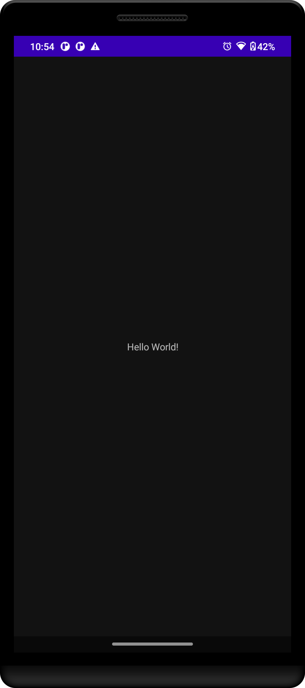

# ArrestoThermal: Thermal SDK Integration for Android

**[Optional: Add a logo or a catchy one-liner image here]**

## Overview

ArrestoThermal is an Android application demonstrating [or utilizing] the integration of a thermal SDK (`thermalsdk-release.aar`). This project aims to [Briefly describe the main purpose of your project, e.g., "showcase how to capture and display thermal imaging data," or "provide a tool for analyzing thermal information from compatible hardware," or "integrate thermal readings into an existing inspection workflow."].

This README provides information on how to set up, build, and understand the project structure.

## Features

*   **Thermal Data Acquisition:** Connects to and retrieves data from compatible thermal hardware via the integrated SDK.
*   **[Specific Feature 1, e.g., Real-time Thermal Image Display]**
*   **[Specific Feature 2, e.g., Temperature Spot Reading]**
*   **[Specific Feature 3, e.g., Palette Switching for Thermal Visualization]**
*   **[Add more specific features of YOUR application]**
*   Demonstrates handling of the `thermalsdk-release.aar` local AAR library.

## Project Structure

The project follows a standard Android application structure:

*   `app/src/main/java/`: Contains the Kotlin source code for the application.
    *   `app/com/azusol/arrestothermal/ui/activites/`: UI-related activities (e.g., `MainActivity.kt`, `ThermalActivity.kt`).
    *   `app/com/azusol/arrestothermal/...`: (Add other key package structures like viewmodels, services, utils etc.)
*   `app/src/main/res/`: Contains application resources like layouts, drawables, strings, etc.
*   `app/libs/`: Contains local libraries, specifically `thermalsdk-release.aar`.
*   `build.gradle.kts` (Module: app): Configuration for the application module, including dependencies.
*   `build.gradle.kts` (Project): Top-level build configuration.
*   `gradle/libs.versions.toml`: Centralized dependency version management.

## Prerequisites

Before you begin, ensure you have met the following requirements:

*   **Android Studio:** Version `[Specify Android Studio Version, e.g., Hedgehog | 2023.1.1 or newer]` installed.
*   **Android SDK:** Target SDK Version `[Specify SDK Version, e.g., 34]` and Min SDK Version `[Specify Min SDK Version, e.g., 24]` installed.
*   **Kotlin:** The project is written in Kotlin `[Specify Kotlin Version, e.g., 1.9.x or 2.0.x]`.
*   **Thermal Hardware (If Applicable):** Access to the thermal hardware compatible with `thermalsdk-release.aar`.
*   **`thermalsdk-release.aar`:** This library is included in the `app/libs/` directory. Ensure it's the correct version if you are obtaining it separately.
*   **[Any other specific software, accounts, or hardware needed]**

